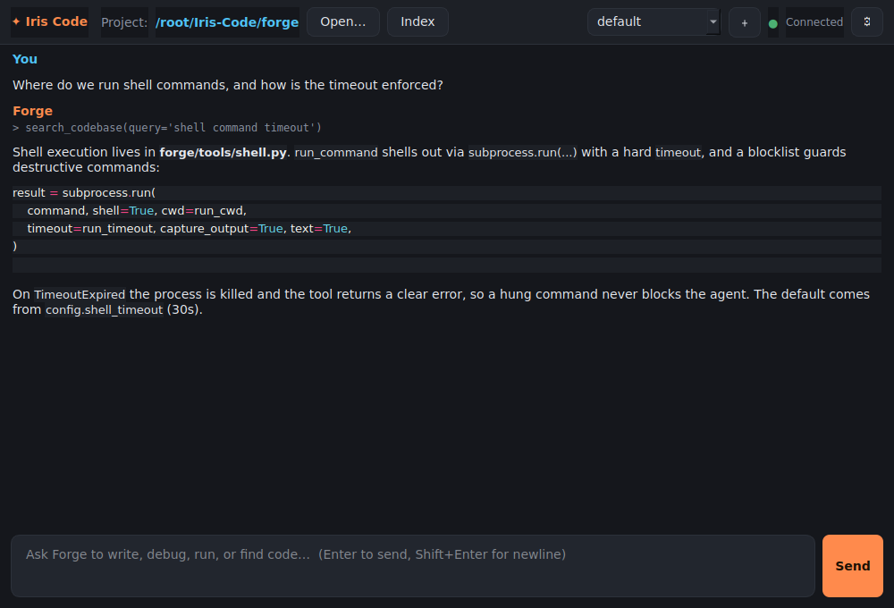
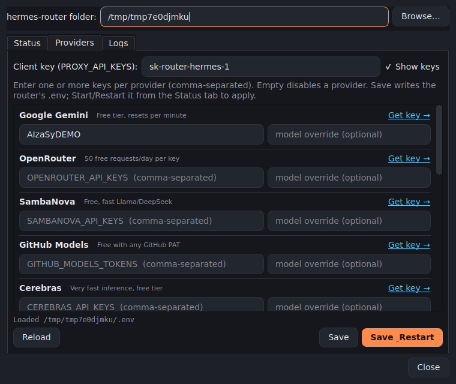

# Iris Code (Forge)

[](https://github.com/Shaf2665/iris-code/actions/workflows/build-desktop.yml)
[](https://github.com/Shaf2665/iris-code/releases/latest)
[](LICENSE)


A personal, developer-focused **coding agent** for your terminal **and** desktop. It chats,
remembers your preferences across sessions, runs shell commands, inspects git, and
semantically searches your codebase — all through a local
[hermes-router](#hermes-router) instance that fans out to free LLM providers.

Iris Code is the single-developer sibling of Iris Teams. The defining difference: **Forge
can execute shell commands and index your codebase.**



## Features

- 🗣️ **Streaming TUI chat** over an OpenAI-compatible router (`prompt_toolkit` + `rich`)
- 🧠 **Persistent personal memory** — coding preferences, stack, project facts, recalled by semantic search
- 🐚 **Shell execution** — `run_command` / `run_tests` with a hard timeout, output truncation, and a destructive-command blocklist
- 🔀 **Git tools** — status, diff, log, blame
- 🔎 **Semantic codebase index** — walk → chunk → embed → search, with incremental SHA-256 re-indexing (unchanged files are skipped)
- 💾 **Named, resumable sessions** persisted to SQLite (WAL)

## Architecture

```
forge/
├── agent.py            # agentic loop (stateless per conversation; caller owns history)
├── llm.py              # hermes-router streaming client (OpenAI-compatible)
├── config.py           # Config dataclass: from_env() + JSON overlay
├── tui.py              # terminal UI + slash commands
├── memory/
│   ├── embedder.py     # hermes-router embeddings, stored as float32 BLOBs
│   ├── personal.py     # durable developer/project facts (semantic search)
│   ├── conversations.py# session persistence
│   └── project_index.py# semantic codebase index (incremental)
└── tools/
    ├── base.py         # tool registry
    ├── context.py      # shared runtime state (active project / index / timeout)
    ├── files.py        # read_file, write_file
    ├── shell.py        # run_command, run_tests
    ├── git.py          # git_status, git_diff, git_log, git_blame_line
    ├── search.py       # search_codebase
    └── web.py          # fetch_url (SSRF-guarded)
```

## Setup

Requires Python 3.11+ and a running hermes-router on `localhost:8319`.

```bash
python -m venv .venv && . .venv/bin/activate
pip install -r requirements.txt
cp .env.example .env        # edit if your router URL/key differ
python -m forge
```

### Configuration (`.env`)

| Var | Default | Meaning |
|---|---|---|
| `FORGE_ROUTER_URL` | `http://localhost:8319` | hermes-router base URL |
| `FORGE_API_KEY` | `sk-router-hermes-1` | router API key (local) |
| `FORGE_MODEL` | `hermes-router` | model / route name |
| `FORGE_DB_PATH` | `forge_memory.db` | SQLite store |
| `FORGE_PROJECT_DIR` | _(none)_ | default active project |
| `FORGE_SHELL_TIMEOUT` | `30` | shell command timeout (s) |

## Commands

```
/project <path>   set the active project        /memory          list saved facts
/run <cmd>        run a shell command            /forget          erase saved facts
/git              git status + recent log        /clear           clear session context
/index [--force]  (re)index for semantic search  /sessions        list saved sessions
/search <query>   semantic codebase search       /switch <name>   switch session
/help  /exit
```

## Desktop app (GUI)

Iris Code also ships a cross-platform **desktop GUI** (PySide6) for Linux, Windows,
and macOS — a windowed chat with the same forge backend, a project picker, a one-click
semantic indexer, a router health indicator, named sessions, and a settings panel.

**Provider** (Settings → *Provider*): defaults to the local **hermes-router**, but you can
point Iris Code at any **OpenAI-compatible** endpoint — built-in presets for OpenAI and
OpenRouter, or a **Custom** base URL — each with its own key and model, with a Test button.

#### Router panel

A built-in **Router** panel (top bar → *Router*) is a control center for your
hermes-router — configure and run it without a terminal. Point it at your
hermes-router folder (the one with `docker-compose.yml` + `.env`), then:

- **Status** — live connection, providers, models, latency, and **Start / Stop /
  Restart / Update** (runs `docker compose` in that folder; Update = `git pull` +
  `up -d --build`).
- **Providers** — a structured editor for all built-in providers (Gemini, OpenRouter,
  Groq, Cerebras, OpenAI, Anthropic, …): enter masked key(s) per provider + an optional
  model override, with a "Get key →" link each. **Save** writes the router's `.env`;
  **Save & Restart** applies it.
- **Logs** — tail `docker compose logs`.

Folder path persists (also via `FORGE_ROUTER_DIR`).



Run it from source:

```bash
pip install -r requirements.txt -r requirements-gui.txt
python iris_code_gui.py          # launch the GUI
python iris_code_gui.py --selftest   # headless build check (no display/router)
```

### Building standalone installers

Packaging is per-OS (PyInstaller can't cross-compile), so installers are built by a
**GitHub Actions matrix** ([`.github/workflows/build-desktop.yml`](.github/workflows/build-desktop.yml)).
Push a tag to produce a release with all three:

```bash
git tag v0.1.0 && git push origin v0.1.0
```

| OS | Output | Build locally |
|---|---|---|
| Linux | one-folder app + `.tar.gz` | `bash scripts/build_linux.sh` |
| Windows | portable `.zip` + Inno Setup installer | `scripts\build_windows.ps1` |
| macOS | `IrisCode.app` + `.dmg` | `bash scripts/build_macos.sh` |

These are **one-folder** builds (a folder with the executable + bundled Python/Qt), which
start faster and trip fewer SmartScreen/antivirus false positives than a single self-extracting
exe. The app is self-contained; end users just need a running hermes-router to point it at.

### Running the installers (unsigned app)

The released binaries are **not code-signed** (signing needs a paid certificate), so the
OS will warn — or, on some Windows 11 machines, block — the first launch:

- **Windows SmartScreen** ("Windows protected your PC") → click **More info → Run anyway**.
- **Windows Smart App Control** (`CreateProcess failed; code 4551 — An Application Control
  policy has blocked this file`) is stricter and has **no "Run anyway"**. If you hit this,
  either run from source (below) or, if you control the machine, turn off Smart App Control
  (Windows Security → App & browser control → Smart App Control). Note: SAC can only be
  turned **off**, not back on, without reinstalling Windows.
- **macOS Gatekeeper** ("unidentified developer") → right-click the app → **Open**, or
  System Settings → Privacy & Security → **Open Anyway**.

**Most reliable path on a locked-down machine — run from source** (the OS trusts the
signed `python.exe`, so nothing is blocked):

```bash
# Windows (PowerShell), after installing Python 3.11+ from python.org:
python -m venv .venv; .\.venv\Scripts\Activate.ps1
pip install -r requirements.txt -r requirements-gui.txt
python iris_code_gui.py
```

The proper fix for distribution is Authenticode/Apple code signing in CI; see the
roadmap. Until then, source is the dependable route on machines with Smart App Control.

## hermes-router

An OpenAI-API-compatible local router that auto-selects among free providers (Gemini,
OpenRouter, Cerebras, Groq, Mistral, ZAI, …) for chat, and Gemini for 3072-dim
embeddings. Point `FORGE_ROUTER_URL` at any OpenAI-compatible endpoint to use your own.

## Status

Layers L1–L3 are complete. Planned next (L4+): web dashboard, debug/TDD/refactor loops,
multi-file edits with diff review. See [`plan.md`](plan.md).

## License

MIT
